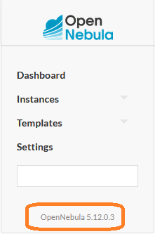

# iac-step-by-step
IaC (Infrastructure as Code) Step by Step

This repository contains examples used in practical labs related to cloud technologies taught at [DCSE](http://www.kiv.zcu.cz/en/education/index.html) / [UWB](https://www.zcu.cz/en/index.html)

## Prerequisites

* An IDE like [Visual Studio Code](https://code.visualstudio.com/) with plugins for  and [Ansible](https://www.ansible.com/)
* [Terraform (HashiCorp)](https://www.terraform.io/) installed
* [Ansible](https://www.ansible.com/) installed
* Access to a [OpenNebula](https://opennebula.io/) account

## Installing Terraform

Just follow the instructions provided at [HashiCorp Learn Website](https://learn.hashicorp.com/tutorials/terraform/install-cli) in order to install the Terraform CLI.

## Installing Ansible

Because Ansible is developed in the [Python language](https://www.python.org/), you will need to install it first if you haven't yet. Then you can install Ansible using ```pip``` as described in the [Ansible Installation Guide](https://docs.ansible.com/ansible/latest/installation_guide/intro_installation.html#installing-and-upgrading-ansible-with-pip)

## Setting up OpenNebula as a Terraform provider

We will setup an OpenNebula client as a Terraform provider in the following three steps:
1. Install OpenNebula Tools
2. Generate an OpenNebula password token and setup the OpenNebula client
3. Define OpenNebula as a provider in the HCL (HashiCorp Configuration Language)

## 1. Installing the OpenNebula Tools

In this short installation guide we will focus only on Ubuntu Linux (which should cover a major set of Linux distros including WSL2).
Before you start with the installation, you have to determine you OS release. One of the following 3 methods should work for you:

```
lsb_release -a
```

```
cat /etc/issue
```

```
cat /etc/os-release
```


Next, it's good to know your OpenNebula frontend version. It's not necessary, but can help to avoid problems with incompatible versions. Login into your local/hosted OpenNebula frontend and look at the navigation menu:



Now you know the versions of both OS release and OpenNebula frontend, so you can access the appropriate repository, for example:

```
https://downloads.opennebula.io/repo/6.3.90/Ubuntu/20.04/
```

or, more suitable for the provided examples: 

```
https://downloads.opennebula.io/repo/5.12.0.4/Ubuntu/20.04/
```

For all available versions, look at [https://downloads.opennebula.io/repo/](https://downloads.opennebula.io/repo/)

Finally, install the OpenNebula Tools by entering these commands:

```
wget -q -O- https://downloads.opennebula.org/repo/repo.key | apt-key add -
echo "deb https://downloads.opennebula.org/repo/5.12.0.4/Ubuntu/20.04 stable opennebula" > /etc/apt/sources.list.d/opennebula.list
apt-get update
apt-get install opennebula-tools
```

## 2. Generate an OpenNebula password token and prepare it for use with OpenNebula CLI Tools

Login into the OpenNebula frontend and generate a login token:


Copy the generated token to the file ```.one/one_auth``` in your home directory:
```
mkdir "$HOME/.one"
echo 'your-username:your-login-token-6f41e9a367b9660etc...' > "$HOME/.one/one_auth"
```
You will be probably using the same frontend the whole time, so you can make your life easier by setting the following environment variable in your ```~/.bashrc``` holding the URL of the default server used by the CLI tools:
```
export ONE_XMLRPC="https://your-opennebula-server/RPC2"
```
Check if your setting work with:
```
oneimage list
onevm list
```

## 3. Defining OpenNebula as a provider in Terraform

At the start of your [HCL (HashiCorp Configuration Language) file](https://www.terraform.io/language) describing the infrastructure components/resources add the following code snippet:

```
terraform {
  required_providers {
    opennebula = {
      source = "OpenNebula/opennebula"
      version = "0.4.3"
    }
  }
}

provider "opennebula" {
  endpoint      = "https://your-opennebula-server/RPC2"
  username      = "your-username"
  password      = "your-login-token-6f41e9a367b9660etc..."
}
```
Of course, replace the provided ```endpoint```, ```username``` and ```password``` values with real ones or use pre-defined variables.

## Provided examples

* [***Step 01***](step-01) - very basic initial example (HCL)
* [***Step 02***](step-02) - remote-exec script provisioner (HCL)
* [***Step 03***](step-03) - create similar VMs (HCL)
