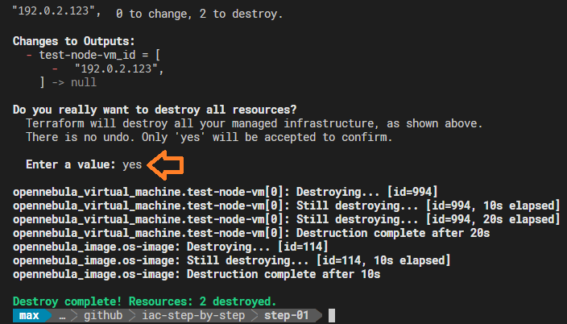

# Step 01 - Creating the first VM

This example shows the basic setup of a simple Terraform project, that creates 1 OS image and running 1 VM based on that image.
This project contains the following three files:

1. **```terraform.tf```** - the description of the resources created.
2. **```variables.tf```** - definition of used variables (like access credentials, public key to copy to the VM, image URL, etc): variable name, variable type, default value and descrition.
3. **```terraform.tfvars```** - this file contains values of variables to be passed to Terraform, when it creates the described resources.

## Initialize the project

If you just created or cloned a project from a repository, you have to initialize it with the command:
``` terraform init```


This is needed only once.

## Check your variable settings

Before you start using Terraform, please check your variable settings in the **```terraform.tfvars```** file. Use your corrent username and login token generated in the OpenNebula frontend, the correct API endpoint URL and do not forget to set your public SSH key, so you are able to connect to the instance:

```
one_username      = "your-username"
one_password      = "your-login-token-6f41e9a367b9660etc..."
one_endpoint      = "https://your-opennebula-server/RPC2"
vm_ssh_pubkey     = "your-public-ssh-key AAAAE2VjZHNhLX...etc...== user@host"
```

## Terraform in Action

Before you create all the defined resources (or a whole architecture), you will probably know, what will Terraform do. It's because the infrastructure may already exist and you want to make changes to it.
The actions Terraform will perform, a so called **plan**, can be displayed by entering the command:

```terraform plan```

For the first time you will see something simillar to this (shortened) output:


But now, let's *"release the Kraken"* and enter:

```terraform apply```

Because this action may not only create or change things, but also remove, Terraform will ask you to approve the listed actions:


The most interesting part of the output is the ***Outputs*** section. There you can see ***references*** to the created resources in a machine readable format.

In this example, we see in the output the IP address of the created VM. So let's try to access it, by using SSH:


If you there, then congratulations, you got your first Terraform project work !

You can do even more checks, if everything went well with the OpenNebula Tools CLI:

List your VMs with ```onevm list```:


or list the available OS images:


In order to clean up your current work, just destroy the whole thing with:

```terraform destroy```



## Final Notes

The Virtual Machine Template (see ```resource "opennebula_virtual_machine" "test-node-vm { ... }"``` in the **```terraform.tf```** file), has a section called ***context*** where you can automate different configuration aspects. The most common attributes are network configuration, user credentials and startup scripts. In this example we pass the hostname, SSH public key and the start script, which is run only once, when the VM is started for the first time. Usually, the script just performs an update of the installed OS. For more complex tasks we will use various VM provisioning method.


